# Final Design 조사·대조 기록 — 2026-09-13

출처: Talk to Figma MCP `join_channel(4z1djd1l)` → `get_document_info` → 각 SECTION의 `get_node_info` → 핵심 화면 `export_node_as_image`. 페이지 이름 `Final Design`, ID `0:1`. Figma 원본은 수정하지 않았다.

이 기록은 **화면 구조·문구·색상과 코드의 대조**다. 앱 실행 스크린샷과의 전 화면 픽셀 검수 완료를 뜻하지 않는다. 핵심 화면 PNG 10종 및 기기 연결 v3 전체 보드 1종을 보관했다. 구현 후 각 상태별 앱 스크린샷 검증이 필요하다.

[기획·설계안](../plans/2026-09-13-app-design-review.md)

## 1. 페이지 전체 섹션 인벤토리

| ID | 섹션 | 직접 자식 수 | 해석 |
|---|---|---:|---|
| 294:2258 | [Refer](https://www.figma.com/design/EMAYOZxHOyeDLZdIahvDkL/vivnanaut?node-id=294-2258) | 123 | 비교 시안·원문 참고; 현행 화면과 충돌 시 자동 적용하지 않음 |
| 362:6206 | [앱 ASIS 0807](https://www.figma.com/design/EMAYOZxHOyeDLZdIahvDkL/vivnanaut?node-id=362-6206) | 33 | 비교 시안·원문 참고; 현행 화면과 충돌 시 자동 적용하지 않음 |
| 932:627 | [Asset_v2](https://www.figma.com/design/EMAYOZxHOyeDLZdIahvDkL/vivnanaut?node-id=932-627) | 75 | 현행 적용 후보·상세 조사 |
| 663:2406 | [기획](https://www.figma.com/design/EMAYOZxHOyeDLZdIahvDkL/vivnanaut?node-id=663-2406) | 2 | 비교 시안·원문 참고; 현행 화면과 충돌 시 자동 적용하지 않음 |
| 802:1244 | [버린/세이브시안](https://www.figma.com/design/EMAYOZxHOyeDLZdIahvDkL/vivnanaut?node-id=802-1244) | 51 | 비교 시안·원문 참고; 현행 화면과 충돌 시 자동 적용하지 않음 |
| 802:1373 | [Camera](https://www.figma.com/design/EMAYOZxHOyeDLZdIahvDkL/vivnanaut?node-id=802-1373) | 38 | 현행 적용 후보·상세 조사 |
| 802:1384 | [Home](https://www.figma.com/design/EMAYOZxHOyeDLZdIahvDkL/vivnanaut?node-id=802-1384) | 47 | 현행 적용 후보·상세 조사 |
| 802:2383 | [CreActivity](https://www.figma.com/design/EMAYOZxHOyeDLZdIahvDkL/vivnanaut?node-id=802-2383) | 10 | 현행 적용 후보·상세 조사 |
| 819:2421 | [기기 연결v1](https://www.figma.com/design/EMAYOZxHOyeDLZdIahvDkL/vivnanaut?node-id=819-2421) | 50 | 비교 시안·원문 참고; 현행 화면과 충돌 시 자동 적용하지 않음 |
| 931:6792 | [Color](https://www.figma.com/design/EMAYOZxHOyeDLZdIahvDkL/vivnanaut?node-id=931-6792) | 5 | 비교 시안·원문 참고; 현행 화면과 충돌 시 자동 적용하지 않음 |
| 959:3747 | [기기 연결v2](https://www.figma.com/design/EMAYOZxHOyeDLZdIahvDkL/vivnanaut?node-id=959-3747) | 56 | 비교 시안·원문 참고; 현행 화면과 충돌 시 자동 적용하지 않음 |
| 971:1590 | [기기 연결v3](https://www.figma.com/design/EMAYOZxHOyeDLZdIahvDkL/vivnanaut?node-id=971-1590) | 69 | 현행 적용 후보·상세 조사 |

`디자인 작업대`(739:2013)는 화면이 아닌 텍스트다. 과거 시안 및 기획 메모에는 자동 가로 확대·2~3일 하이라이트 등 폐기되는 요구가 섞여 있다. 최신 사용자 지시로 덮어쓴다.

## 2. 확인한 코드 차이

| 영역 | 근거 파일·위치 | 현재 동작과 차이 |
|---|---|---|
| 대표 온습도 | `home/presentation/env_detail_screen.dart:291` | 과거는 마지막 버킷. 일평균으로 변경 필요 |
| 주간 막대 | `home/presentation/widgets/week_range_chart.dart:220` | 최고/나머지 2색만 존재. 일반/최저 3색 분리 필요 |
| 카메라 갱신 | `my_cage/presentation/my_cage_providers.dart:117` | cameras Realtime 전체 재조회가 날짜/시간대 provider로 전파되는 경로 |
| 목록 로딩 | `my_cage/presentation/crecam_screen.dart` `_HourClipSections` | 새 로딩에서 목록 대신 스켈레톤. 스크롤 높이 변경 가설 검증 필요 |
| 조회 한도 | `my_cage/presentation/my_cage_providers.dart:276` | 하루 최대 200개. 날짜 없는 커서 조회로 확장 |
| 연결 표시 | `my_cage/presentation/widgets/camera_live_area.dart:220` | 상단 status 배지 전달 제거 대상 |
| 썸네일 | `my_cage/presentation/widgets/motion_clip_thumb.dart` | 캐시는 있으나 URL provider 뒤에 있어 네트워크 대기 |
| 읽음 | `my_cage/domain/highlight_group.dart` `highlightGroupKey` | 최신 대표 촬영시각이 dismiss key. 배치 식별자/재생 이벤트 필요 |
| 세로 플레이어 | `my_cage/presentation/clip_playlist_player_screen.dart` | 구 컨트롤·Material 아이콘, 최신 썸네일 스트립/가로 버튼 없음 |
| 라이브 확대 | `my_cage/presentation/camera_live_fullscreen_screen.dart` | initState에서 landscape 강제 |
| 팬 | `home/presentation/cage_control_actions.dart:192` | 꺼진 팬은 저장된 선택을 즉시 실행. 선택 시트부터 열도록 변경 |
| MyCre | `my_pets/presentation/my_pets_screen.dart`, `my_cage/presentation/nightly_report_view.dart` | 개체목록/리포트 세그먼트. Figma 일간/주간 활동 차트와 구조 차이 |
| 연결·관리 | `my_cage/presentation/widgets/wifi_provisioning_view.dart`, `enclosure_settings_screen.dart` | 종류별 페어링/배정 구조. v3 통합 선택·그룹 관리로 확장 필요 |

파일 경로는 `lib/features/` 기준. 상세 설계에서 해당 기능·데이터·검증 조건을 함께 정의했다.

## 3. 팔레트·실측 차이

| 역할 | 현재 라이트 토큰/사용값 | Figma 값·근거 |
|---|---|---|
| 카드 면 | `surfaceTint #F0F4F9` | `#F4F4F4`, NewHighlight 945:4331 / Asset 932:816 |
| 헤더·일반 배경 | 기존 푸른/흰 표면 구성 | `#FAFAFA`, 941:1835 / 932:818 |
| 보조 텍스트 | `textTertiary #919497` | `#949090`, 945:4178 |
| 온도 대표 글자 | `tempAccent #F85478` | `#C00306`, 945:3440 |
| 온도 그래프 | `tempAccent #F85478` | `#D61619`, 945:3491 |
| 습도 대표 글자 | `humidAccent #00B2F3` | `#192553`, 945:3517 |
| 습도 그래프 | `humidAccent #00B2F3` | `#2E408C`, 945:3568 |
| 일반 막대 | `textSecondary #3C3C3C` | `#626262`, 945:3487 |
| 최저 막대 | 없음 | `#B4AEAE`, 945:3499 / 945:3503 |
| 최저 대표 글자 | `textTertiary #919497` | `#949090`, 945:3441 / 945:3518 |
| 환기팬 | `deviceFan #00B591` | `#228C73`, 934:1076 |
| 비활성 기기 | `deviceOff #A9B3BE` | `#B4AEAE`, 934:1066 |
| 냉각/LED | 현재 기기 토큰 | `#636DDB` / `#E89E00`, 934:1074 / 934:1077 |

대표 수치와 그래프의 색이 서로 다르므로 `tempAccent`/`humidAccent` 한 쌍만 일괄 치환하면 원본과 달라진다. 텍스트·그래프·기기·탭 활성의 역할별 토큰을 분리한다. 다크 원본은 확인되지 않았으므로 라이트 값을 그대로 다크에 복제하지 않는다.

| 요소 | 실측 |
|---|---|
| 표준 프레임 | 393pt 폭, 기본 852pt 높이. 긴 콘텐츠 프레임은 실제 고정 화면 높이가 아님 |
| NewHighlight | 945:4331, radius 12 / 패딩 20 / 329×172.316 썸네일 스택 / 44×44 닫기 터치영역 |
| 주간 | 945:3428, 좌우 여백 12 / 369×32 세그먼트 / 369×40 날짜 / 각 지표 369×297 |
| 엔트리 업데이트 | Pretendard Medium 14, letterSpacing -0.28, 색 #949090 |
| 세로 플레이어 | 941:1834, 영상 393×224 / 컨트롤 369×36 / 하단 조작 308×48 / 썸네일 높이 40 |
| 가로 플레이어 | 941:1928, 852×393 / 이전다음 48×48 / 닫기 44×44 / 컨트롤 756×36 |

안전영역·글자 확대에 대응하는 제약식으로 구현한다. Figma 캔버스의 절대 x/y 또는 상태바 62pt를 앱에 그대로 하드코딩하지 않는다.

## 4. SVG 매핑 대상으로 확인한 노드

| 용도 | 원본 노드 | 조치 |
|---|---|---|
| 하이라이트 엔트리 | 945:4172 cards_star | 기존 cards_star 에셋의 도형·여백 대조 |
| 북마크 엔트리 | 945:4180 bookmark | 기존 bookmark_check와 실제 형태 대조 |
| 이전/다음 | 941:1849 / 941:1861 arrow_back_ios_new | 터치면과 glyph를 분리해 원본 SVG 사용 |
| 다운로드/공유 | 941:1853 download / 941:1855 share | Material 근사 아이콘 교체 |
| 북마크 | 941:1857 bookmark | 선택/미선택 및 그리드 배지 변형 확인 |
| 삭제/닫기 | 941:1864 delete / 941:2120 close | 삭제 의미 계약은 별도, 도형만으로 기능 추정 금지 |
| 재생/배속 | 941:1868 play_arrow / 941:1910 speed_2x | 재생·일시정지·배속 상태별 에셋 매핑 |
| 하단 내비 | 945:4259 home / 945:4262 camera_video / 945:4265 fertile / 945:4268 mode_comment | 현재 nav SVG와 상태색 확인 |
| 기기 켜짐/꺼짐 | Asset_v2 934:1058~1072의 각 도형 | 활성·비활성 도형 차이까지 적용 |

에셋은 구현 시 SVG로 export하고 이름·원본 nodeId·viewBox·tint 가능 여부를 함께 기록한다. 전체 버튼 배경과 아이콘 도형을 중복해서 그리지 않는다. 앱 에셋 폴더는 이번 설계 단계에서 수정하지 않았다.

## 5. 활성 작업 영역의 프레임 전수 목록

아래는 각 섹션의 직접 프레임과 하위 섹션을 빠짐없이 나열한 것이다. 동일 이름의 복수 프레임은 상태/시안 변형이므로 최종 적용 상태를 구별해야 한다. 세부 컴포넌트의 모든 레이어를 별도 화면으로 세지 않는다.

### Home

| 노드 | 이름 | 크기 |
|---|---|---|
| 735:1031 | [iPhone 14 & 15 Pro - 17](https://www.figma.com/design/EMAYOZxHOyeDLZdIahvDkL/vivnanaut?node-id=735-1031) | 393.0 × 852.0 |
| 802:1517 | [TempHumid_Detail](https://www.figma.com/design/EMAYOZxHOyeDLZdIahvDkL/vivnanaut?node-id=802-1517) | 393.0 × 1090.0 |
| 849:1620 | [TempHumid_Detail](https://www.figma.com/design/EMAYOZxHOyeDLZdIahvDkL/vivnanaut?node-id=849-1620) | 393.0 × 590.0 |
| 849:1814 | [TempHumid_Detail](https://www.figma.com/design/EMAYOZxHOyeDLZdIahvDkL/vivnanaut?node-id=849-1814) | 393.0 × 590.0 |
| 845:470 | [TempHumid_Detail](https://www.figma.com/design/EMAYOZxHOyeDLZdIahvDkL/vivnanaut?node-id=845-470) | 393.0 × 910.0 |
| 819:6062 | [Button/Enabled](https://www.figma.com/design/EMAYOZxHOyeDLZdIahvDkL/vivnanaut?node-id=819-6062) | 44.0 × 44.0 |
| 819:6076 | [Button/Enabled](https://www.figma.com/design/EMAYOZxHOyeDLZdIahvDkL/vivnanaut?node-id=819-6076) | 44.0 × 44.0 |
| 819:6058 | [Button/Enabled](https://www.figma.com/design/EMAYOZxHOyeDLZdIahvDkL/vivnanaut?node-id=819-6058) | 44.0 × 44.0 |
| 819:6054 | [Button/Enabled](https://www.figma.com/design/EMAYOZxHOyeDLZdIahvDkL/vivnanaut?node-id=819-6054) | 44.0 × 44.0 |
| 849:1805 |  | 193.0 × 37.0 |
| 857:3856 |  | 73.0 × 37.0 |
| 849:1808 |  | 169.0 × 37.0 |
| 849:2002 |  | 154.0 × 37.0 |
| 849:2013 | [그래프 스크롤](https://www.figma.com/design/EMAYOZxHOyeDLZdIahvDkL/vivnanaut?node-id=849-2013) | 1431.0 × 1561.0 |
| 945:3245 | [TempHumid_Detail](https://www.figma.com/design/EMAYOZxHOyeDLZdIahvDkL/vivnanaut?node-id=945-3245) | 393.0 × 1084.0 |
| 945:3650 | [TempHumid_Detail](https://www.figma.com/design/EMAYOZxHOyeDLZdIahvDkL/vivnanaut?node-id=945-3650) | 393.0 × 584.0 |
| 945:3867 | [TempHumid_Detail](https://www.figma.com/design/EMAYOZxHOyeDLZdIahvDkL/vivnanaut?node-id=945-3867) | 393.0 × 584.0 |
| 945:3428 | [TempHumid_Detail](https://www.figma.com/design/EMAYOZxHOyeDLZdIahvDkL/vivnanaut?node-id=945-3428) | 393.0 × 1084.0 |
| 945:4043 | [Home](https://www.figma.com/design/EMAYOZxHOyeDLZdIahvDkL/vivnanaut?node-id=945-4043) | 393.0 × 852.0 |

### Camera

| 노드 | 이름 | 크기 |
|---|---|---|
| 855:3238 | [iPhone 14 & 15 Pro - 51](https://www.figma.com/design/EMAYOZxHOyeDLZdIahvDkL/vivnanaut?node-id=855-3238) | 393.0 × 1563.0 |
| 858:4549 | [iPhone 14 & 15 Pro - 55](https://www.figma.com/design/EMAYOZxHOyeDLZdIahvDkL/vivnanaut?node-id=858-4549) | 393.0 × 852.0 |
| 857:4212 | [Button/Abled](https://www.figma.com/design/EMAYOZxHOyeDLZdIahvDkL/vivnanaut?node-id=857-4212) | 178.5 × 72.0 |
| 857:4236 | [Button/Abled](https://www.figma.com/design/EMAYOZxHOyeDLZdIahvDkL/vivnanaut?node-id=857-4236) | 178.5 × 72.0 |
| 857:4252 | [Button/Abled](https://www.figma.com/design/EMAYOZxHOyeDLZdIahvDkL/vivnanaut?node-id=857-4252) | 178.5 × 72.0 |
| 857:4220 | [Button/Abled](https://www.figma.com/design/EMAYOZxHOyeDLZdIahvDkL/vivnanaut?node-id=857-4220) | 178.5 × 72.0 |
| 857:4244 | [Button/Abled](https://www.figma.com/design/EMAYOZxHOyeDLZdIahvDkL/vivnanaut?node-id=857-4244) | 178.5 × 72.0 |
| 857:4260 | [Button/Abled](https://www.figma.com/design/EMAYOZxHOyeDLZdIahvDkL/vivnanaut?node-id=857-4260) | 178.5 × 72.0 |
| 857:3745 | [bookmark](https://www.figma.com/design/EMAYOZxHOyeDLZdIahvDkL/vivnanaut?node-id=857-3745) | 32.0 × 32.0 |
| 802:1048 | [iPhone 14 & 15 Pro - 29](https://www.figma.com/design/EMAYOZxHOyeDLZdIahvDkL/vivnanaut?node-id=802-1048) | 393.0 × 852.0 |
| 945:4287 | [iPhone 14 & 15 Pro - 68](https://www.figma.com/design/EMAYOZxHOyeDLZdIahvDkL/vivnanaut?node-id=945-4287) | 393.0 × 852.0 |
| 857:4079 | [iPhone 14 & 15 Pro - 53](https://www.figma.com/design/EMAYOZxHOyeDLZdIahvDkL/vivnanaut?node-id=857-4079) | 393.0 × 852.0 |
| 802:1247 | [iPhone 14 & 15 Pro - 33](https://www.figma.com/design/EMAYOZxHOyeDLZdIahvDkL/vivnanaut?node-id=802-1247) | 393.0 × 852.0 |
| 945:4351 | [iPhone 14 & 15 Pro - 69](https://www.figma.com/design/EMAYOZxHOyeDLZdIahvDkL/vivnanaut?node-id=945-4351) | 393.0 × 852.0 |
| 802:1190 | [iPhone 14 & 15 Pro - 32](https://www.figma.com/design/EMAYOZxHOyeDLZdIahvDkL/vivnanaut?node-id=802-1190) | 393.0 × 852.0 |
| 941:1578 | [Toast_V](https://www.figma.com/design/EMAYOZxHOyeDLZdIahvDkL/vivnanaut?node-id=941-1578) | 71.0 × 34.0 |
| 941:1497 | [iPhone 14 & 15 Pro - 62](https://www.figma.com/design/EMAYOZxHOyeDLZdIahvDkL/vivnanaut?node-id=941-1497) | 393.0 × 852.0 |
| 941:1834 | [iPhone 14 & 15 Pro - 64](https://www.figma.com/design/EMAYOZxHOyeDLZdIahvDkL/vivnanaut?node-id=941-1834) | 393.0 × 852.0 |
| 941:1928 | [iPhone 14 & 15 Pro - 65](https://www.figma.com/design/EMAYOZxHOyeDLZdIahvDkL/vivnanaut?node-id=941-1928) | 852.0 × 393.0 |
| 941:2062 | [iPhone 14 & 15 Pro - 66](https://www.figma.com/design/EMAYOZxHOyeDLZdIahvDkL/vivnanaut?node-id=941-2062) | 852.0 × 393.0 |
| 941:1525 | [bookmark](https://www.figma.com/design/EMAYOZxHOyeDLZdIahvDkL/vivnanaut?node-id=941-1525) | 36.0 × 36.0 |
| 857:3858 |  | 139.0 × 37.0 |
| 857:3861 |  | 135.0 × 37.0 |
| 857:4165 |  | 105.0 × 37.0 |
| 941:1577 | [bookmark](https://www.figma.com/design/EMAYOZxHOyeDLZdIahvDkL/vivnanaut?node-id=941-1577) | 36.0 × 36.0 |
| 945:4147 | [iPhone 14 & 15 Pro - 67](https://www.figma.com/design/EMAYOZxHOyeDLZdIahvDkL/vivnanaut?node-id=945-4147) | 393.0 × 1935.0 |

### CreActivity

| 노드 | 이름 | 크기 |
|---|---|---|
| 925:1516 | [iPhone 14 & 15 Pro - 56](https://www.figma.com/design/EMAYOZxHOyeDLZdIahvDkL/vivnanaut?node-id=925-1516) | 393.0 × 1172.0 |
| 945:4815 | [Card](https://www.figma.com/design/EMAYOZxHOyeDLZdIahvDkL/vivnanaut?node-id=945-4815) | 369.5 × 112.0 |
| 925:4667 | [iPhone 14 & 15 Pro - 57](https://www.figma.com/design/EMAYOZxHOyeDLZdIahvDkL/vivnanaut?node-id=925-4667) | 393.0 × 1155.0 |
| 925:1558 | [Card](https://www.figma.com/design/EMAYOZxHOyeDLZdIahvDkL/vivnanaut?node-id=925-1558) | 369.0 × 112.0 |
| 925:4908 | [Card](https://www.figma.com/design/EMAYOZxHOyeDLZdIahvDkL/vivnanaut?node-id=925-4908) | 369.0 × 112.0 |
| 925:4917 | [Card](https://www.figma.com/design/EMAYOZxHOyeDLZdIahvDkL/vivnanaut?node-id=925-4917) | 369.0 × 112.0 |
| 925:1578 | [Card](https://www.figma.com/design/EMAYOZxHOyeDLZdIahvDkL/vivnanaut?node-id=925-1578) | 369.0 × 112.0 |
| 945:4384 | [iPhone 14 & 15 Pro - 70](https://www.figma.com/design/EMAYOZxHOyeDLZdIahvDkL/vivnanaut?node-id=945-4384) | 393.0 × 1155.0 |
| 945:4596 | [iPhone 14 & 15 Pro - 71](https://www.figma.com/design/EMAYOZxHOyeDLZdIahvDkL/vivnanaut?node-id=945-4596) | 393.0 × 1155.0 |

### Asset_v2

| 노드 | 이름 | 크기 |
|---|---|---|
| 932:761 | [Toast](https://www.figma.com/design/EMAYOZxHOyeDLZdIahvDkL/vivnanaut?node-id=932-761) | 241.0 × 60.0 |
| 934:868 | [Button/Abled](https://www.figma.com/design/EMAYOZxHOyeDLZdIahvDkL/vivnanaut?node-id=934-868) | 180.5 × 72.0 |
| 934:1058 | [mode_fan_2](https://www.figma.com/design/EMAYOZxHOyeDLZdIahvDkL/vivnanaut?node-id=934-1058) | 40.0 × 40.0 |
| 934:990 | [Button/Abled](https://www.figma.com/design/EMAYOZxHOyeDLZdIahvDkL/vivnanaut?node-id=934-990) | 180.5 × 72.0 |
| 934:953 | [Button/Disabled](https://www.figma.com/design/EMAYOZxHOyeDLZdIahvDkL/vivnanaut?node-id=934-953) | 180.5 × 72.0 |
| 934:1066 | [mode_fan_off](https://www.figma.com/design/EMAYOZxHOyeDLZdIahvDkL/vivnanaut?node-id=934-1066) | 40.0 × 40.0 |
| 934:874 | [Button/Enabled](https://www.figma.com/design/EMAYOZxHOyeDLZdIahvDkL/vivnanaut?node-id=934-874) | 180.5 × 72.0 |
| 934:1062 | [humidity_high](https://www.figma.com/design/EMAYOZxHOyeDLZdIahvDkL/vivnanaut?node-id=934-1062) | 40.0 × 40.0 |
| 934:959 | [Button/Disabled](https://www.figma.com/design/EMAYOZxHOyeDLZdIahvDkL/vivnanaut?node-id=934-959) | 180.5 × 72.0 |
| 934:1072 | [format_color_reset](https://www.figma.com/design/EMAYOZxHOyeDLZdIahvDkL/vivnanaut?node-id=934-1072) | 40.0 × 40.0 |
| 934:1004 | [Button/Disabled](https://www.figma.com/design/EMAYOZxHOyeDLZdIahvDkL/vivnanaut?node-id=934-1004) | 180.5 × 72.0 |
| 934:880 | [Button/Abled](https://www.figma.com/design/EMAYOZxHOyeDLZdIahvDkL/vivnanaut?node-id=934-880) | 180.5 × 72.0 |
| 934:1060 | [mode_cool](https://www.figma.com/design/EMAYOZxHOyeDLZdIahvDkL/vivnanaut?node-id=934-1060) | 40.0 × 40.0 |
| 934:1012 | [Button/Abled](https://www.figma.com/design/EMAYOZxHOyeDLZdIahvDkL/vivnanaut?node-id=934-1012) | 180.5 × 72.0 |
| 934:1064 | [lightbulb](https://www.figma.com/design/EMAYOZxHOyeDLZdIahvDkL/vivnanaut?node-id=934-1064) | 40.0 × 40.0 |
| 934:965 | [Button/Disabled](https://www.figma.com/design/EMAYOZxHOyeDLZdIahvDkL/vivnanaut?node-id=934-965) | 180.5 × 72.0 |
| 934:1068 | [mode_cool_off](https://www.figma.com/design/EMAYOZxHOyeDLZdIahvDkL/vivnanaut?node-id=934-1068) | 40.0 × 40.0 |
| 934:1020 | [Button/Disabled](https://www.figma.com/design/EMAYOZxHOyeDLZdIahvDkL/vivnanaut?node-id=934-1020) | 180.5 × 72.0 |
| 934:1070 | [light_off](https://www.figma.com/design/EMAYOZxHOyeDLZdIahvDkL/vivnanaut?node-id=934-1070) | 40.0 × 40.0 |
| 934:1028 | [lightbulb](https://www.figma.com/design/EMAYOZxHOyeDLZdIahvDkL/vivnanaut?node-id=934-1028) | 36.0 × 36.0 |
| 934:1030 | [mode_cool](https://www.figma.com/design/EMAYOZxHOyeDLZdIahvDkL/vivnanaut?node-id=934-1030) | 36.0 × 36.0 |
| 934:1032 | [mode_fan_2](https://www.figma.com/design/EMAYOZxHOyeDLZdIahvDkL/vivnanaut?node-id=934-1032) | 36.0 × 36.0 |
| 934:1034 | [humidity_high](https://www.figma.com/design/EMAYOZxHOyeDLZdIahvDkL/vivnanaut?node-id=934-1034) | 36.0 × 36.0 |
| 934:1036 | [light_off](https://www.figma.com/design/EMAYOZxHOyeDLZdIahvDkL/vivnanaut?node-id=934-1036) | 36.0 × 36.0 |
| 934:1038 | [mode_fan_off](https://www.figma.com/design/EMAYOZxHOyeDLZdIahvDkL/vivnanaut?node-id=934-1038) | 36.0 × 36.0 |
| 934:1040 | [mode_cool_off](https://www.figma.com/design/EMAYOZxHOyeDLZdIahvDkL/vivnanaut?node-id=934-1040) | 36.0 × 36.0 |
| 934:1042 | [humidity_high](https://www.figma.com/design/EMAYOZxHOyeDLZdIahvDkL/vivnanaut?node-id=934-1042) | 28.0 × 28.0 |
| 934:1045 | [light_off](https://www.figma.com/design/EMAYOZxHOyeDLZdIahvDkL/vivnanaut?node-id=934-1045) | 28.0 × 28.0 |
| 934:1047 | [mode_cool_off](https://www.figma.com/design/EMAYOZxHOyeDLZdIahvDkL/vivnanaut?node-id=934-1047) | 28.0 × 28.0 |
| 934:1049 | [mode_fan_off](https://www.figma.com/design/EMAYOZxHOyeDLZdIahvDkL/vivnanaut?node-id=934-1049) | 28.0 × 28.0 |
| 934:1052 | [lightbulb](https://www.figma.com/design/EMAYOZxHOyeDLZdIahvDkL/vivnanaut?node-id=934-1052) | 28.0 × 28.0 |
| 934:1054 | [mode_cool](https://www.figma.com/design/EMAYOZxHOyeDLZdIahvDkL/vivnanaut?node-id=934-1054) | 28.0 × 28.0 |
| 934:1056 | [mode_fan_2](https://www.figma.com/design/EMAYOZxHOyeDLZdIahvDkL/vivnanaut?node-id=934-1056) | 28.0 × 28.0 |
| 934:1081 | [Navigation](https://www.figma.com/design/EMAYOZxHOyeDLZdIahvDkL/vivnanaut?node-id=934-1081) | 393.0 × 80.0 |
| 934:1152 | [Tag](https://www.figma.com/design/EMAYOZxHOyeDLZdIahvDkL/vivnanaut?node-id=934-1152) | 40.0 × 24.0 |
| 934:1154 | [Tag](https://www.figma.com/design/EMAYOZxHOyeDLZdIahvDkL/vivnanaut?node-id=934-1154) | 40.0 × 24.0 |
| 934:1102 | [Card](https://www.figma.com/design/EMAYOZxHOyeDLZdIahvDkL/vivnanaut?node-id=934-1102) | 369.0 × 112.0 |
| 934:1111 | [Card](https://www.figma.com/design/EMAYOZxHOyeDLZdIahvDkL/vivnanaut?node-id=934-1111) | 369.0 × 112.0 |
| 934:1120 | [Card](https://www.figma.com/design/EMAYOZxHOyeDLZdIahvDkL/vivnanaut?node-id=934-1120) | 369.0 × 112.0 |
| 934:1129 | [Card](https://www.figma.com/design/EMAYOZxHOyeDLZdIahvDkL/vivnanaut?node-id=934-1129) | 369.0 × 112.0 |
| 934:1137 | [Card](https://www.figma.com/design/EMAYOZxHOyeDLZdIahvDkL/vivnanaut?node-id=934-1137) | 369.0 × 112.0 |

### 기기 연결v3

| 노드 | 이름 | 크기 |
|---|---|---|
| 971:1592 | [iPhone 14 & 15 Pro - 160](https://www.figma.com/design/EMAYOZxHOyeDLZdIahvDkL/vivnanaut?node-id=971-1592) | 393.0 × 1289.0 |
| 994:13348 | [iPhone 14 & 15 Pro - 212](https://www.figma.com/design/EMAYOZxHOyeDLZdIahvDkL/vivnanaut?node-id=994-13348) | 393.0 × 1289.0 |
| 971:1809 | [iPhone 14 & 15 Pro - 161](https://www.figma.com/design/EMAYOZxHOyeDLZdIahvDkL/vivnanaut?node-id=971-1809) | 393.0 × 852.0 |
| 971:1837 | [기기 검색01](https://www.figma.com/design/EMAYOZxHOyeDLZdIahvDkL/vivnanaut?node-id=971-1837) | 393.0 × 852.0 |
| 990:11220 | [기기 검색02](https://www.figma.com/design/EMAYOZxHOyeDLZdIahvDkL/vivnanaut?node-id=990-11220) | 393.0 × 852.0 |
| 990:7601 | [기기 선택01](https://www.figma.com/design/EMAYOZxHOyeDLZdIahvDkL/vivnanaut?node-id=990-7601) | 393.0 × 852.0 |
| 990:7744 | [기기 선택02](https://www.figma.com/design/EMAYOZxHOyeDLZdIahvDkL/vivnanaut?node-id=990-7744) | 393.0 × 852.0 |
| 987:4213 | [그룹추가 - 결과](https://www.figma.com/design/EMAYOZxHOyeDLZdIahvDkL/vivnanaut?node-id=987-4213) | 393.0 × 852.0 |
| 982:3947 | [기기 관리 - NONE](https://www.figma.com/design/EMAYOZxHOyeDLZdIahvDkL/vivnanaut?node-id=982-3947) | 393.0 × 852.0 |
| 990:12196 | [기기 관리 - NONE](https://www.figma.com/design/EMAYOZxHOyeDLZdIahvDkL/vivnanaut?node-id=990-12196) | 393.0 × 852.0 |
| 990:12320 | [기기 관리 - NONE](https://www.figma.com/design/EMAYOZxHOyeDLZdIahvDkL/vivnanaut?node-id=990-12320) | 393.0 × 852.0 |
| 990:11767 | [iPhone 14 & 15 Pro - 207](https://www.figma.com/design/EMAYOZxHOyeDLZdIahvDkL/vivnanaut?node-id=990-11767) | 393.0 × 852.0 |
| 990:11607 | [기기 관리](https://www.figma.com/design/EMAYOZxHOyeDLZdIahvDkL/vivnanaut?node-id=990-11607) | 393.0 × 852.0 |
| 990:12147 | [기기 관리](https://www.figma.com/design/EMAYOZxHOyeDLZdIahvDkL/vivnanaut?node-id=990-12147) | 393.0 × 852.0 |
| 994:12994 | [기기 관리](https://www.figma.com/design/EMAYOZxHOyeDLZdIahvDkL/vivnanaut?node-id=994-12994) | 393.0 × 852.0 |
| 982:3103 | [네트워크 설정](https://www.figma.com/design/EMAYOZxHOyeDLZdIahvDkL/vivnanaut?node-id=982-3103) | 393.0 × 852.0 |
| 990:11306 | [네트워크 설정](https://www.figma.com/design/EMAYOZxHOyeDLZdIahvDkL/vivnanaut?node-id=990-11306) | 393.0 × 852.0 |
| 982:3174 | [네트워크 비밀번호](https://www.figma.com/design/EMAYOZxHOyeDLZdIahvDkL/vivnanaut?node-id=982-3174) | 393.0 × 852.0 |
| 982:3643 | [추가 완료- 사육장](https://www.figma.com/design/EMAYOZxHOyeDLZdIahvDkL/vivnanaut?node-id=982-3643) | 393.0 × 852.0 |
| 990:7549 | [추가 완료- 카메라](https://www.figma.com/design/EMAYOZxHOyeDLZdIahvDkL/vivnanaut?node-id=990-7549) | 393.0 × 852.0 |
| 990:11583 | [추가 완료-사육장,카메라](https://www.figma.com/design/EMAYOZxHOyeDLZdIahvDkL/vivnanaut?node-id=990-11583) | 393.0 × 852.0 |
| 990:7508 | [iPhone 14 & 15 Pro - 205](https://www.figma.com/design/EMAYOZxHOyeDLZdIahvDkL/vivnanaut?node-id=990-7508) | 393.0 × 852.0 |
| 987:4507 | [Modal](https://www.figma.com/design/EMAYOZxHOyeDLZdIahvDkL/vivnanaut?node-id=987-4507) | 345.0 × 144.0 |
| 990:6225 | [Modal](https://www.figma.com/design/EMAYOZxHOyeDLZdIahvDkL/vivnanaut?node-id=990-6225) | 345.0 × 200.0 |
| 990:6662 | [Modal](https://www.figma.com/design/EMAYOZxHOyeDLZdIahvDkL/vivnanaut?node-id=990-6662) | 345.0 × 144.0 |
| 990:7040 | [Modal](https://www.figma.com/design/EMAYOZxHOyeDLZdIahvDkL/vivnanaut?node-id=990-7040) | 345.0 × 144.0 |
| 982:3413 | [네트워크 비밀번호](https://www.figma.com/design/EMAYOZxHOyeDLZdIahvDkL/vivnanaut?node-id=982-3413) | 393.0 × 852.0 |
| 982:3459 | [네트워크 비밀번호](https://www.figma.com/design/EMAYOZxHOyeDLZdIahvDkL/vivnanaut?node-id=982-3459) | 393.0 × 852.0 |
| 982:3604 | [네트워크 연결 로딩](https://www.figma.com/design/EMAYOZxHOyeDLZdIahvDkL/vivnanaut?node-id=982-3604) | 393.0 × 852.0 |
| 990:11564 | [Button/Enabled](https://www.figma.com/design/EMAYOZxHOyeDLZdIahvDkL/vivnanaut?node-id=990-11564) | 44.0 × 44.0 |
| 971:1921 | [iPhone 14 & 15 Pro - 164](https://www.figma.com/design/EMAYOZxHOyeDLZdIahvDkL/vivnanaut?node-id=971-1921) | 393.0 × 852.0 |
| 971:1978 | [iPhone 14 & 15 Pro - 165](https://www.figma.com/design/EMAYOZxHOyeDLZdIahvDkL/vivnanaut?node-id=971-1978) | 393.0 × 852.0 |
| 971:2011 | [iPhone 14 & 15 Pro - 166](https://www.figma.com/design/EMAYOZxHOyeDLZdIahvDkL/vivnanaut?node-id=971-2011) | 393.0 × 852.0 |
| 987:4517 | [그룹 추가 - 마지막 확인](https://www.figma.com/design/EMAYOZxHOyeDLZdIahvDkL/vivnanaut?node-id=987-4517) | 393.0 × 852.0 |
| 990:6405 | [기기상세](https://www.figma.com/design/EMAYOZxHOyeDLZdIahvDkL/vivnanaut?node-id=990-6405) | 393.0 × 852.0 |
| 994:13113 | [기기상세](https://www.figma.com/design/EMAYOZxHOyeDLZdIahvDkL/vivnanaut?node-id=994-13113) | 393.0 × 852.0 |
| 990:12559 | [기기상세 - 그룹관리](https://www.figma.com/design/EMAYOZxHOyeDLZdIahvDkL/vivnanaut?node-id=990-12559) | 393.0 × 852.0 |
| 994:13167 | [기기상세 - 그룹관리](https://www.figma.com/design/EMAYOZxHOyeDLZdIahvDkL/vivnanaut?node-id=994-13167) | 393.0 × 852.0 |
| 990:12444 | [iPhone 14 & 15 Pro - 209](https://www.figma.com/design/EMAYOZxHOyeDLZdIahvDkL/vivnanaut?node-id=990-12444) | 393.0 × 852.0 |
| 990:12500 | [iPhone 14 & 15 Pro - 210](https://www.figma.com/design/EMAYOZxHOyeDLZdIahvDkL/vivnanaut?node-id=990-12500) | 393.0 × 852.0 |
| 990:7184 | [iPhone 14 & 15 Pro - 202](https://www.figma.com/design/EMAYOZxHOyeDLZdIahvDkL/vivnanaut?node-id=990-7184) | 393.0 × 852.0 |
| 990:6669 | [기기상세](https://www.figma.com/design/EMAYOZxHOyeDLZdIahvDkL/vivnanaut?node-id=990-6669) | 393.0 × 852.0 |
| 990:6321 | [그룹 상세](https://www.figma.com/design/EMAYOZxHOyeDLZdIahvDkL/vivnanaut?node-id=990-6321) | 393.0 × 852.0 |
| 987:4815 | [그룹추가 - 이름설정](https://www.figma.com/design/EMAYOZxHOyeDLZdIahvDkL/vivnanaut?node-id=987-4815) | 393.0 × 852.0 |
| 987:5869 | [그룹추가 - 이름설정](https://www.figma.com/design/EMAYOZxHOyeDLZdIahvDkL/vivnanaut?node-id=987-5869) | 393.0 × 852.0 |
| 987:5094 | [그룹 추가 - 기기 선택](https://www.figma.com/design/EMAYOZxHOyeDLZdIahvDkL/vivnanaut?node-id=987-5094) | 393.0 × 852.0 |
| 987:5715 | [그룹 추가 - 기기 선택](https://www.figma.com/design/EMAYOZxHOyeDLZdIahvDkL/vivnanaut?node-id=987-5715) | 393.0 × 852.0 |
| 990:7307 | [iPhone 14 & 15 Pro - 203](https://www.figma.com/design/EMAYOZxHOyeDLZdIahvDkL/vivnanaut?node-id=990-7307) | 393.0 × 852.0 |
| 990:11291 | [Icon](https://www.figma.com/design/EMAYOZxHOyeDLZdIahvDkL/vivnanaut?node-id=990-11291) | 295.0 × 132.0 |
| 982:3500 | [네트워크 비밀번호 - 오류](https://www.figma.com/design/EMAYOZxHOyeDLZdIahvDkL/vivnanaut?node-id=982-3500) | 393.0 × 852.0 |
| 990:11450 | [기기 검색02 - 오류](https://www.figma.com/design/EMAYOZxHOyeDLZdIahvDkL/vivnanaut?node-id=990-11450) | 393.0 × 852.0 |
| 990:11380 | [네트워크 설정 - 오류](https://www.figma.com/design/EMAYOZxHOyeDLZdIahvDkL/vivnanaut?node-id=990-11380) | 393.0 × 852.0 |
| 990:12615 | [iPhone 14 & 15 Pro - 200](https://www.figma.com/design/EMAYOZxHOyeDLZdIahvDkL/vivnanaut?node-id=990-12615) | 393.0 × 852.0 |
| 990:12706 | [iPhone 14 & 15 Pro - 201](https://www.figma.com/design/EMAYOZxHOyeDLZdIahvDkL/vivnanaut?node-id=990-12706) | 393.0 × 852.0 |
| 994:13307 | [iPhone 14 & 15 Pro - 211](https://www.figma.com/design/EMAYOZxHOyeDLZdIahvDkL/vivnanaut?node-id=994-13307) | 393.0 × 852.0 |

## 6. PNG 참조 화면

앱 캡처가 아니라 이번에 MCP에서 읽은 Figma 원본이다.

### 홈

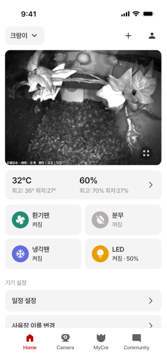

### 온습도 일간

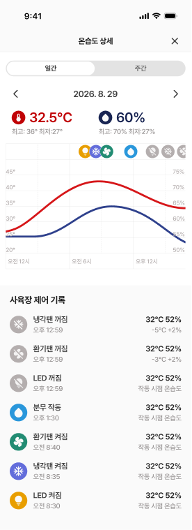

### 온습도 주간

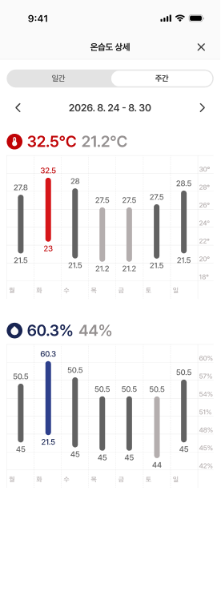

### 카메라 전체 목록

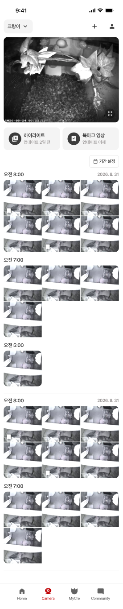

### 하이라이트

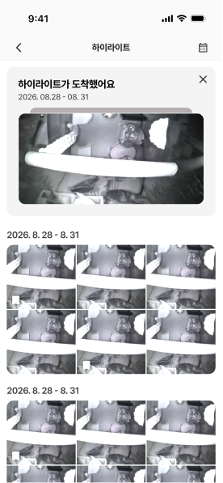

### 북마크

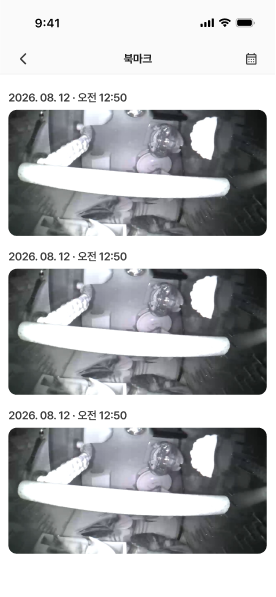

### 세로 플레이어

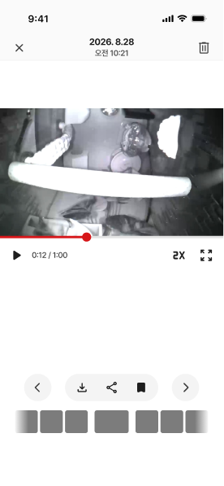

### 가로 플레이어

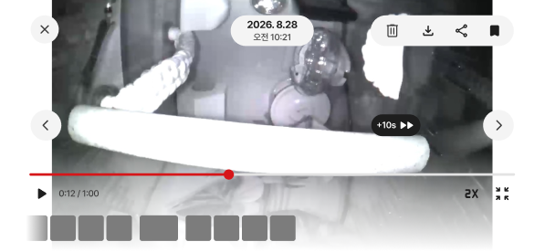

### MyCre 활동

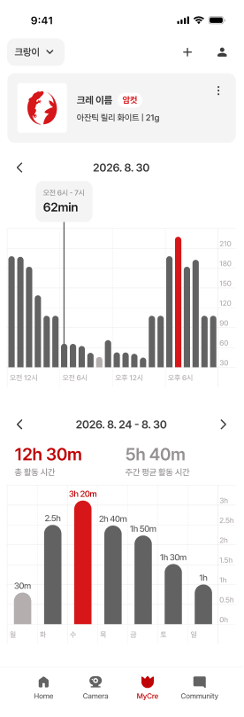

### Asset_v2 개요

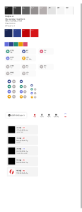

### 기기 연결 v3 전체 흐름

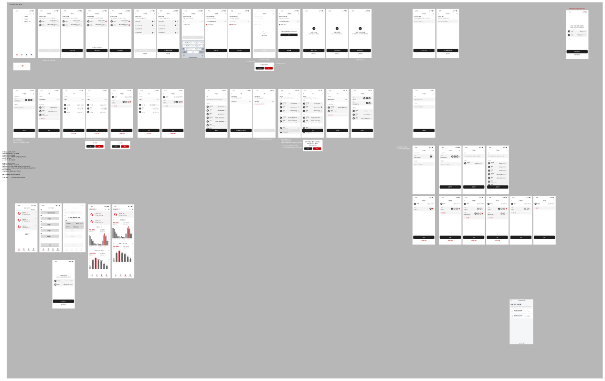

## 7. 검토 범위와 후속

- 핵심 요청 화면: 구조·텍스트·색·핵심 치수·PNG 시각 확인 및 관련 코드 대조.
- MyCre: 구조·본문·PNG 및 현재 화면 구성 차이 확인. 통계 집계 재설계는 별도 구현 단위.
- 기기 연결 v3: 각 프레임·본문·분기와 전체 보드 조사. 개별 프레임별 실제 앱 화면의 세밀한 픽셀 대조는 다음 단계.
- Refer/ASIS/버린 시안/기획/v1/v2/Color: 섹션 전체 데이터 조회, 현행과 혼합하지 않도록 분류.
- Community의 별도 최종 화면은 현행 작업 영역에서 찾지 못했다. 내비·팔레트 공통 변경 외에 커뮤니티 기능 변경을 추정하지 않는다.
- 서버 배치 발행/그룹·전원 계약은 Figma 그림만으로 검증할 수 없다. 필요한 계약을 기획안에 명시했다.
